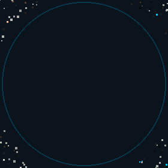

<div align="center">

<!-- ═══════════════════════════════════════════
     ARSLAN NAEEM — GitHub Profile
     ═══════════════════════════════════════════ -->


<br/>

<!-- Particle assemble → hold → scatter loop (GitHub cannot run hover JS) -->


<br/><br/>

### Frontend Engineer · UI Systems Builder · Performance-Focused Developer


<br/>

<p>
  <a href="https://linkedin.com/in/YOUR-LINK"></a>
  &nbsp;
  <a href="mailto:your@email.com"></a>
  &nbsp;
  <a href="https://github.com/chaanioi"></a>
</p>


</div>

---

## Engineering Philosophy

> *Great frontend is not UI — it’s architecture, performance, and user psychology working together.*

| Principle | What it means in practice |
|:---|:---|
| **Systems over screens** | Scalable component architecture that grows without collapsing |
| **Performance first** | Measure, then optimize — no shortcuts that cost users time |
| **Predictable code** | Clear contracts, typed boundaries, maintainable structure |
| **Real users** | Design for behavior and accessibility, not just aesthetics |

---

## System Profile

```ts
type Engineer = {
  name: string;
  role: string;
  experience: string;
  focus: string[];
  stack: string[];
  strengths: string[];
};

const arslan: Engineer = {
  name: "Arslan Naeem",
  role: "Frontend Engineer",
  experience: "2+ Years",
  focus: [
    "UI Systems",
    "Component Architecture",
    "Web Performance",
  ],
  stack: [
    "React",
    "Next.js",
    "TypeScript",
    "JavaScript (ES6+)",
    "Tailwind CSS",
  ],
  strengths: [
    "Scalable UI Architecture",
    "Performance Optimization",
    "Reusable Component Systems",
    "Clean Code Practices",
  ],
};
```

---

## Tech Stack

<div align="center">

### Languages & Core
<p>
  
</p>

### Frameworks & Libraries
<p>
  
</p>

### Tooling & Workflow
<p>
  
</p>

</div>

---

## GitHub Analytics

<div align="center">

<a href="https://github.com/chaanioi">
  
</a>
&nbsp;
<a href="https://github.com/chaanioi">
  
</a>

<br/><br/>


<br/><br/>

<!-- Auto-updated by .github/workflows/main.yml (requires METRICS_TOKEN secret) -->


</div>

---

## What I’m Building Toward

- Production-grade **design systems** and reusable UI kits  
- **Core Web Vitals**-aware React / Next.js applications  
- Architecture that stays clean as teams and features scale  

---

<div align="center">


<sub>Designed with intention · Built with TypeScript · Optimized for humans</sub>

</div>
