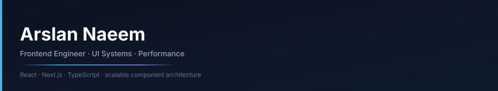
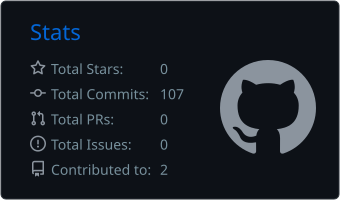
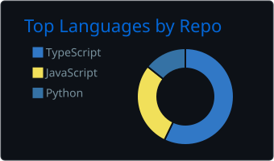
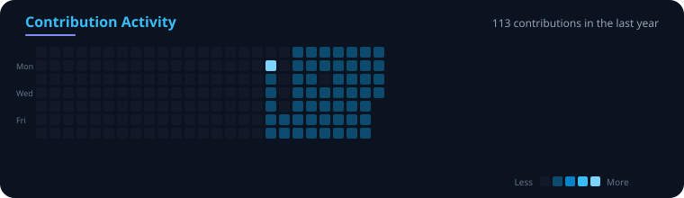

<div align="center">
  
  <br/><br/>
  
</div>

<br/>

**Frontend engineer** building scalable UI systems with React, Next.js, and TypeScript. Focused on component architecture, performance, and interfaces that stay maintainable as products grow.

<p align="center">
  <a href="https://github.com/chaanioi"></a>
  <a href="https://linkedin.com/in/YOUR-LINK"></a>
  <a href="mailto:your@email.com"></a>
</p>

---

### Focus

| Area | Approach |
| :--- | :--- |
| **UI systems** | Reusable component architecture that scales with the product |
| **Performance** | Measure first, then optimize what users actually feel |
| **Code quality** | Typed boundaries, clear contracts, maintainable structure |
| **Product sense** | Design for real behavior — not just polish |

### Stack

```ts
const stack = {
  core: ["React", "Next.js", "TypeScript"],
  styling: ["Tailwind CSS", "Modern CSS"],
  practices: ["Component systems", "Web performance", "Clean architecture"],
};
```

<p align="center">
  
</p>

---

### Activity

<p align="center">
  
  
</p>

<p align="center">
  
</p>

<p align="center">
  
</p>
